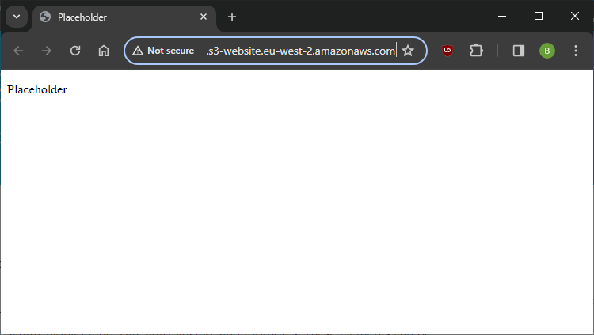

I have a personal AWS account, though it hasn't been used in a long time, so it needed a bit of basic housekeeping. Following the dashboard recommendations, I removed access keys and enabled MFA on the root account, then enabled an IAM Identity Center directory and created myself a separate IAM account for day-to-day usage. MFA is also required for IAM accounts.

I anticipate that I will be primarily using the AWS console to familiarise myself with the services and options, but would like to move towards [Terraform](https://www.terraform.io/) later.

So, the first step is creating an simple storage service (S3) bucket. There are [bucket naming rules](https://docs.aws.amazon.com/AmazonS3/latest/userguide/bucketnamingrules.html?icmpid=docs_amazons3_console) to consider, but the key point being that the name must be globally unique since it will form part of the FQDN used to access it. Next, I've configured [static website hosting](https://docs.aws.amazon.com/AmazonS3/latest/userguide/EnableWebsiteHosting.html) which provides a website endpoint for the bucket; this is only HTTP and would be better as HTTPS so I will revisit this later.

For now, I will upload placeholder HTML so that I can focus on all of the cloud infrastructure and DevOps pipelines first then work on the resume content when the automation is all running.

Public access is blocked on a new bucket by default, but for this project it is safe to make public to all, so I have configured a policy as follows:
```json
{
	"Version": "2012-10-17",
	"Id": "BucketPolicy",
	"Statement": [
		{
			"Sid": "AllAccess",
			"Effect": "Allow",
			"Principal": "*",
			"Action": "s3:*",
			"Resource": [
				"arn:aws:s3:::bucket-name-here",
				"arn:aws:s3:::bucket-name-here/*"
			]
		}
	]
}
```

And this gives me a publicly accessible static website:



We're off to a good start.